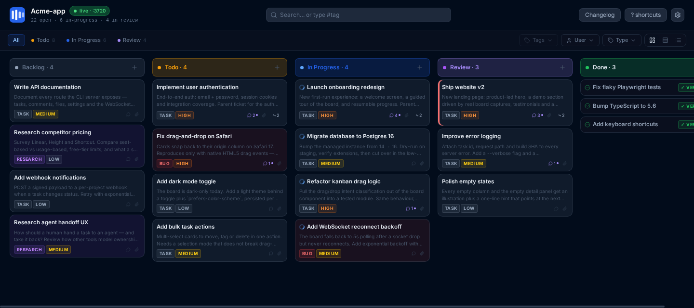
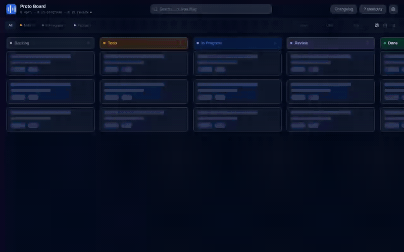
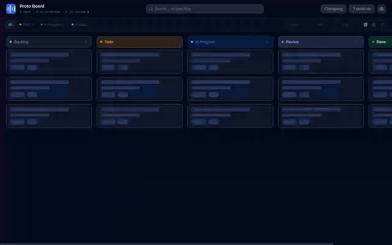
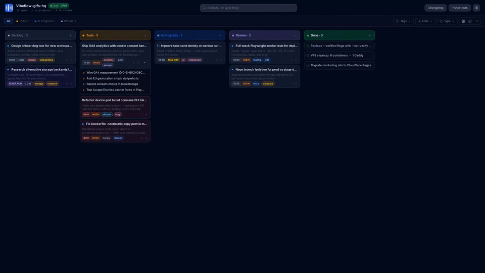

# Vibeflow

> **Tell your AI agent exactly what to fix — by clicking on it.**

Vibeflow eliminates the back-and-forth of describing UI bugs in words. Click any element on a page to create a task with its exact CSS selector, URL, and source location. Your agent gets precise, actionable context — no "the button in the top right" needed.

🌐 [Website](https://vibeflow.tools) · 📖 [Tutorial](https://vibeflow.tools/tutorial)



---

## Why It Matters

AI agents write code fast, but **understanding what to change is slow**. Describing a UI issue in prose wastes tokens and produces wrong fixes.

Vibeflow turns visual feedback into structured tasks:

- **Click any element** → instant task with CSS selector, URL, and source file location
- **Track on a Kanban board** → see everything at a glance, drag between columns
- **Agents implement with context** → no guessing, no wrong elements, no wasted iterations

Perfect for small UI fixes, broken layouts, spacing issues, and anything where pointing is faster than explaining.

---

## Install

Run it once with `npx` — nothing to install:

```bash
npx @vibeflow-tools/cli kanban
```

Or install it globally for day two. This adds the short alias `vf`:

```bash
npm install -g @vibeflow-tools/cli
vibeflow kanban                  # or: vf kanban
```

**Requirements:** Node.js >= 22. Apache-2.0 licensed. No account and no cloud — every task is a JSON file in your repo.

---

## Quick Start

```bash
# 1. Start the local server and open the Kanban board
npx @vibeflow-tools/cli kanban

# 2. Annotate a running app: open http://localhost:3700/inject and drag the
#    bookmarklet onto your bookmarks bar (or use the script tag / console snippet)

# 3. Click elements in your app to create tasks — the CSS selector, URL and
#    source location are captured for you. You can also create tasks on the board.

# 4. Let your agent pick up the next task with full context
npx @vibeflow-tools/cli tasks --next
```

---

## See It in Action

### Drag tasks across the board



Backlog → Todo → In Progress → Review → Done. Drag a card to change its status and the
board persists the new column and order, even after a reload. Tag, user and type filters
keep their state while you move work, and every change is written straight to the task
store — so the CLI and your agent see it immediately.

### Break work into a parent / child tree



Turn an epic into child tasks that keep their own status, priority and history. Expand
the tree inline on the card, or create children from the terminal with
`vibeflow tasks --add --title "..." --parent <id>`. The same hierarchy comes back from
`vibeflow tasks --get <id>`, so an agent can pick up a leaf without losing the parent.

### Get the whole ticket in one panel



Open any card for the full ticket: status, description, tags, priority, author,
relations (children and related tasks), an activity feed and file attachments. Changes
save automatically, and pasting a screenshot or file anywhere in the panel attaches it
to the task instead of your Downloads folder.

---

## Commands

| Command | Description |
| --------- | ------------- |
| `vibeflow kanban [dir]` | Start the server and open the live Kanban board in your browser |
| `vibeflow serve [target]` | Serve HTML files with live annotation overlay, or run API-only task server for existing apps |
| `vibeflow tasks` | List, filter, create, edit, and comment on tasks |
| `vibeflow watch [dir]` | Watch the task store and print ticket details for important updates |
| `vibeflow telemetry` | Manage CLI usage telemetry (opt-out at any time) |

### `vibeflow kanban [dir]`

```bash
vibeflow kanban                   # open Kanban board for current directory
vibeflow kanban ./my-project      # open Kanban for a specific project
```

The Kanban board provides a visual task tracker with drag-and-drop columns, parent/child
task trees, agent status display, and file attachments. Create tasks directly on the
board or import them from annotated prototypes.

### `vibeflow serve [target]`

```bash
vibeflow serve .                  # serve all HTML files in current directory
vibeflow serve dashboard.html     # serve a single file
vibeflow serve -p 4000 .          # custom port
vibeflow serve --no-open .        # don't open browser automatically
vibeflow serve                    # API-only mode — connects to an existing hosted app
```

Serve HTML prototypes with the annotation overlay — click any element to create a task with its CSS selector, URL, and source location.

### `vibeflow tasks`

Full task management from the command line — designed to be agent-friendly.

```bash
# Pick the next task (auto-claims a todo task)
vibeflow tasks --next                             # picks highest-priority todo task
vibeflow tasks --next --type Bug                  # next bug task only

# List tasks
vibeflow tasks                                    # tasks (default: 5 most recent)
vibeflow tasks --limit 0                          # show all tasks (no limit)
vibeflow tasks --json                             # machine-readable JSON output

# Filter
vibeflow tasks --status todo                      # by status
vibeflow tasks --type Bug                         # by type (Task, Bug, Feature, Enhancement, Research)
vibeflow tasks --user dev@example.com             # by author email
vibeflow tasks --tag frontend --tag urgent        # by tags (AND matching)

# Get full details of a single task
vibeflow tasks --get <id>                         # supports partial ID prefix

# Create a task, or a child of an existing one
vibeflow tasks --add --title "Fix header" --description "Button overflows on mobile"
vibeflow tasks --add --title "Adjust the tour copy" --parent <id>

# Edit a task
vibeflow tasks --edit <id> --set-status in-progress
vibeflow tasks --edit <id> --title "Updated title" --description "More detail"

# Mark as review (requires implementation report)
vibeflow tasks --edit <id> --set-status review \
  --commit-message "fix: header layout" \
  --comment "Fixed the alignment issue by adjusting flex-wrap"
```

**Task types:** Task · Bug · Feature · Enhancement · Research  
**Task statuses:** backlog → todo → in-progress → review → done  
**Priorities:** Critical · High · Medium · Low

### `vibeflow watch [dir]`

```bash
vibeflow watch                    # watch the current directory's task store
vibeflow watch ./my-project       # watch a specific project
vibeflow watch --json             # emit events as JSONL to stdout
vibeflow watch --once             # one-shot poll, then exit
```

Runs until interrupted (Ctrl+C) and prints full ticket details whenever a task is
newly created or moved back to `todo` — handy as a driver for AI-agent loops that
react to new work. Events can also be written to a file (`--output <file>`) or POSTed
to a webhook (`--webhook <url>`).

### `vibeflow telemetry`

```bash
vibeflow telemetry              # show current status
vibeflow telemetry --disable    # opt out of usage tracking
vibeflow telemetry --enable     # opt back in
```

No PII is ever collected. User identity is hashed.

---

## Browser Overlay

The overlay is a Shadow DOM panel injected into any page — HTML prototypes or live apps:

- **Click-to-annotate** — click any element to open a task form, pre-filled with CSS selector, URL, and source location
- **Task sidebar** — lists open tasks with status badges; click to jump to the annotated element
- **Task indicators** — numbered markers on annotated elements
- **Real-time sync** — over WebSocket with live file watching
- **Screenshot capture** — attach screenshots to tasks via the overlay
- **Dark theme** — polished dark UI, no configuration needed
- **Keyboard shortcut** — `Alt+A` to toggle annotation mode
- **CSP-safe injection** — bookmarklet bypasses `script-src` restrictions

### Injection Methods

The overlay can be injected into any page three ways:

| Method | Best for | CSP-safe |
| -------- | ---------- | ---------- |
| **Bookmarklet** (recommended) | Any page, including production apps | Yes |
| **Script tag** | Pages you control the HTML of | No |
| **DevTools console** | Quick one-off sessions | Yes |

Visit `/inject` on your running server for ready-to-use bookmarklets and snippets.

---

## How It Works

```
You browse your app  →  click to annotate  →  task created with context
          ↑                                         ↓
    browser reloads  ←  agent implements  ←  vibeflow tasks --next
```

1. **Overlay** — embed the bookmarklet or script into your app, click any element to annotate
2. **Kanban** — open the board to see all tasks at a glance, create new ones directly
3. **Tasks** — `vibeflow tasks --next` picks the highest-priority task with full context for your agent
4. **Iterate** — agent implements, browser reloads, annotate again

---

## Writing Prototypes

Each HTML file is one screen. Use Tailwind CSS, Lucide icons, and Google Fonts via CDN — the annotation contract tells your LLM to use exactly these libraries.

**Rules:**

- One file per screen — name after the route (`login.html`, `dashboard.html`)
- Every meaningful element gets a `data-vibeflow-id` — kebab-case, globally unique
- Navigate between pages with relative links: `<a href="./page.html">`
- Repeat navigation on every page (no shared includes)

```html
<!DOCTYPE html>
<html lang="en">
<head>
  <meta charset="UTF-8">
  <meta name="viewport" content="width=device-width, initial-scale=1">
  <title>App — Dashboard</title>
  <script src="https://cdn.tailwindcss.com"></script>
  <script src="https://unpkg.com/lucide@latest/dist/umd/lucide.min.js"></script>
  <link href="https://fonts.googleapis.com/css2?family=Inter:wght@400;500;600;700&display=swap" rel="stylesheet">
  <style>body { font-family: 'Inter', sans-serif; }</style>
</head>
<body class="bg-gray-50 text-gray-900 min-h-screen">
  <main data-vibeflow-id="main-content" class="max-w-4xl mx-auto px-6 py-8">
    <h1 data-vibeflow-id="page-title" class="text-2xl font-semibold">Dashboard</h1>
  </main>
  <script>lucide.createIcons();</script>
</body>
</html>
```

---

## Agent Integration

Vibeflow tasks are formatted for AI agents with full context:

- **CSS selectors** — exact element targeting, no guesswork
- **Source locations** — file, line, and column where the element is defined
- **Screenshots** — visual context attached to tasks
- **Comments** — threaded discussions on each task
- **File attachments** — research reports, specs, and reference materials
- **Git commits** — changes linked back to tasks via `[proto:task-id]` in commit messages

Agents can also run directly from the Kanban board via `POST /api/agent/run`, which spawns [opencode](https://github.com/opencode-ai/opencode) with full task context.

---

## API

A REST API and tRPC router are available at `http://localhost:3700` for integrations and the browser overlay. Key endpoints:

- `/kanban` — live Kanban board
- `GET/POST /api/tasks` — list and create tasks
- `GET/PATCH/DELETE /api/tasks/:id` — manage individual tasks
- `GET/POST /api/tasks/:id/comments` — task comments
- `GET/POST/DELETE /api/tasks/:id/files` — file attachments
- `POST /api/agent/run` — spawn an AI agent for a task
- `/inject` — overlay injection helper page

See [src/server/server.ts](https://github.com/zorcec/vibeflow/blob/main/packages/cli/src/server/server.ts) for the full API.

---

## Contributing

```bash
pnpm install       # install dependencies
pnpm build:cli     # build CLI
pnpm test          # unit tests
pnpm test:e2e      # end-to-end tests
```

---

## License

[Apache-2.0](https://www.apache.org/licenses/LICENSE-2.0) — see [NOTICE](https://github.com/zorcec/vibeflow/blob/main/NOTICE) for third-party attributions.
